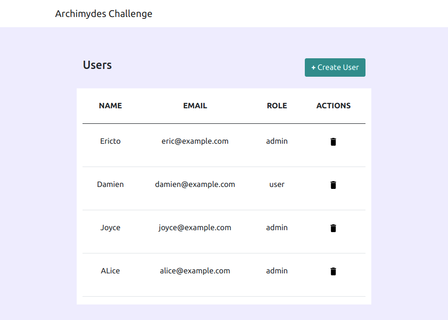
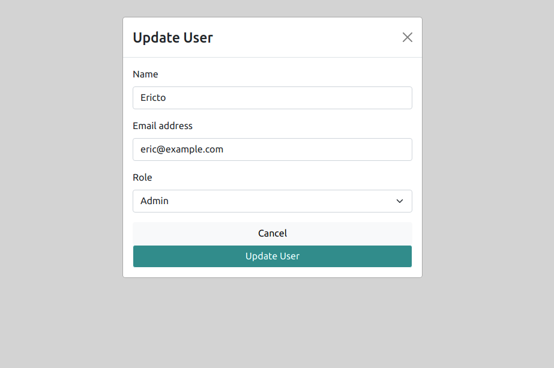

# User Management Console

## Index

- [The Challenge](#the-challenge)
- [How I made it](#how-i-made-it)
- [What can be improved](#what-can-be-improved)
- [How to run the app](#how-to-run-the-app)

 

## The challenge

- Create a view which lists out Users
- Upon clicking the delete icon the user must be deleted from the list
- Clicking on Create User a modal must be presented to the user to create a new user
- There are two roles for users — User and Admin
- The role selection must be a select element
- Upon adding the new user, the list of users must reflect the change
- Clicking on an existing user, a modal with their details must be presented to the user to update details
- Upon updating the user details, it should also reflect in the list of users

## How I made it

- React.js - _UI_
- Custom CSS and React boostrap - _design_

 

- Four main components:
  - header
  - Home - all the data manipulation occurs here, data and states are passed as props
  - Table View to render the data in table
  - Modal for user creation and updation
- used useEffect hook to update Modal on prop change

- Imported Data using an Object for now, can be switched with API call

## What can be improved

- tests can be added to check the creation, deletion and updation of user details
- simple client side validation can be added on the form

## How to run the app

- download code
- run `npm install` in base of the project folder
- run `npm start` in the base of the folder, open `http://localhost:3000` to view in browser
